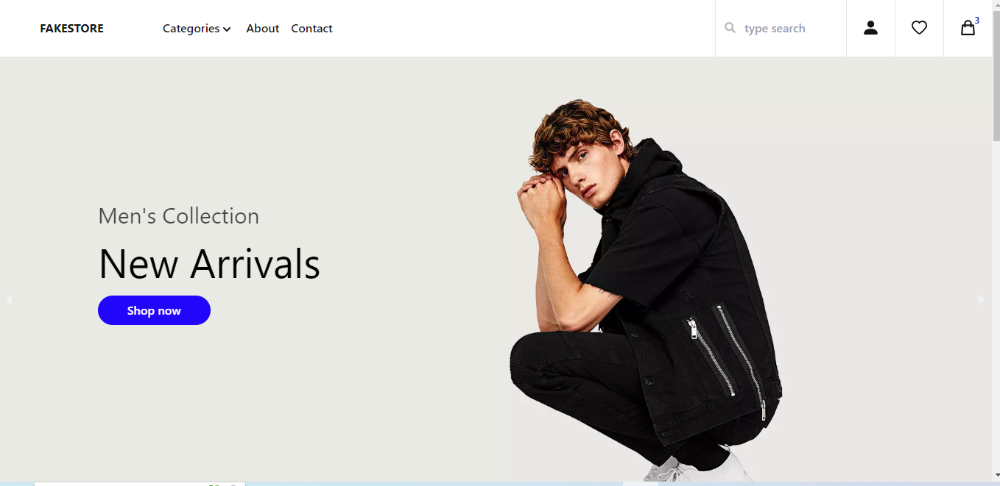
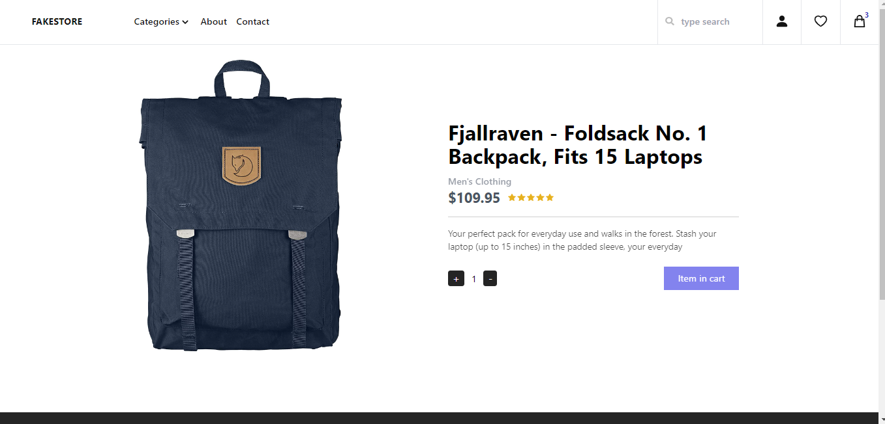
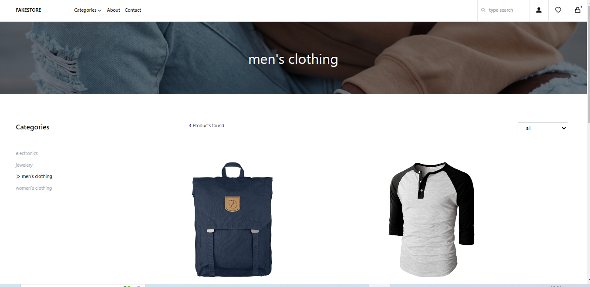
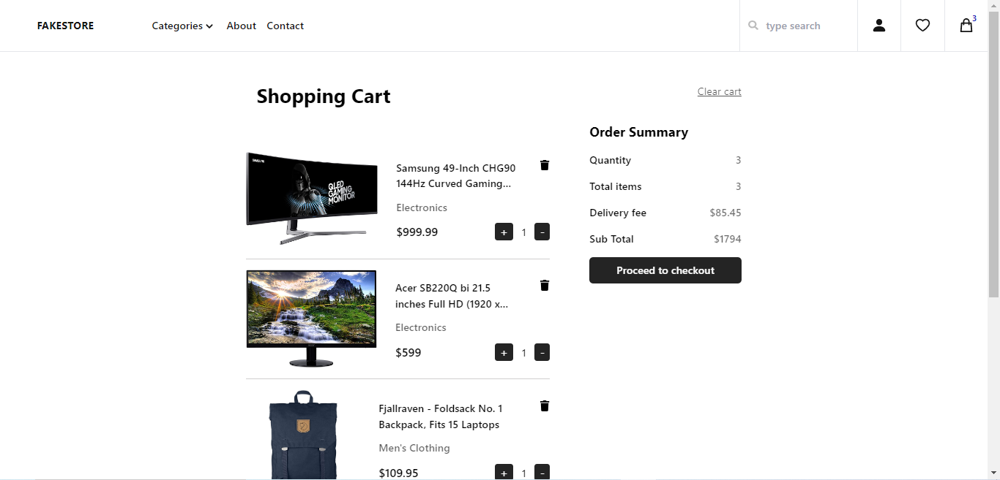
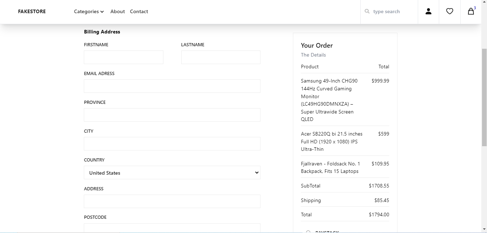
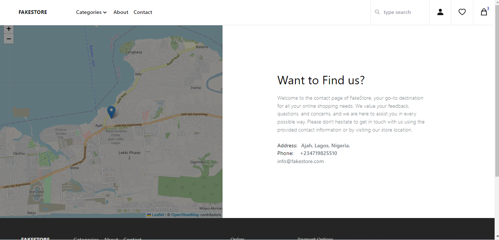
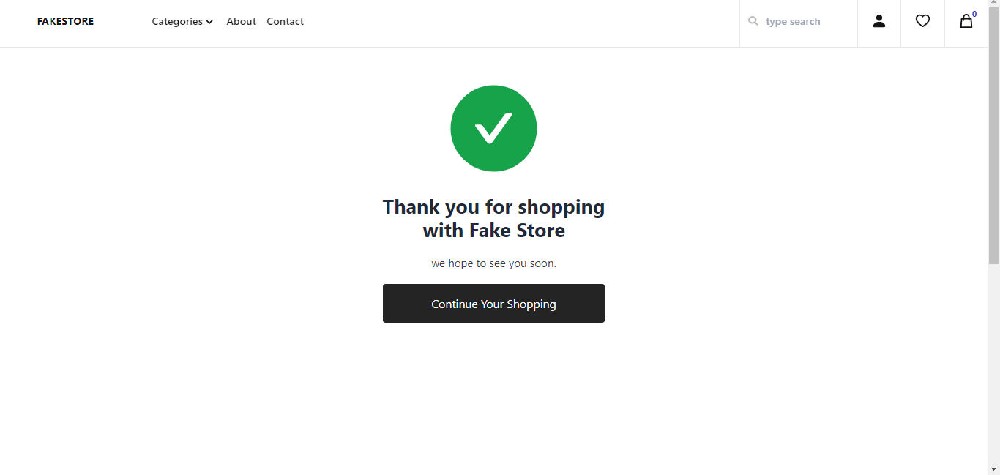
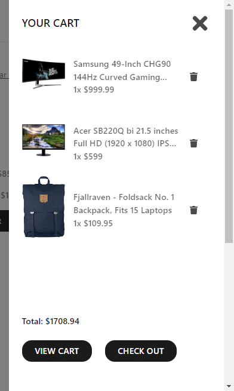

# SM Store

An Ecommerce  Application built with React, Fake store api and Flutterwave SDK for payment integration.


<div align="center">
    <a href="https://fake-store-blond-pi.vercel.app/">View Demo</a>
  <span> · </span>
    <a href="https://github.com/Nathan-Somto/FakeStore/blob/main/README.md">Documentation</a>
  <span> · </span>
    <a href="https://github.com/Nathan-Somto/FakeStore/issues">Report Bug</a>
  <span> · </span>
    <a href="https://github.com/Nathan-Somto/FakeStore/pulls">Request Feature</a>
  </div>


- [Reason for Project](#reason-for-project)
  - [Screenshots](#screenshots)
  - [Tech Stack](#tech-stack)
- [Getting Started](#getting-started)
  -  [Prerequisites ](#prerequisites)
  - [Installation](#installation)
  - [Flutterwave-Test-cards](#flutterwave-test-cards)
- [Contact](#contact)
- [Acknowledgements](#acknowledgements)

## Reason for Project
I wanted to learn about managing state in a react application using redux, So i took code with mosh's redux course and finished the redux essentials  in the redux docs which introduced me to **Redux Toolkit** a modern way to write redux logic.

The project was a bit challenging. 
Considering , i had never worked with redux before.

I also wanted to learn about integrating a payment platform into a react application, initially i tried stripe but for some reason Nigeria is not under the listed countries for stripe, so i decided to use the `Flutterwave SDK` for React and it turned out good.

some redux code i worte
```Javascript
    export const cartSlice = createSlice({
  name: "cart",
  initialState,
  reducers: {
    addToCart(state, action: addToCartAction) {
      // gets the new item that is to be added to the cart and increase's it's quantity by 1
      let { quantity } = action.payload;
      quantity = quantity < 1 ? 1 : quantity;
      state.items = [...state.items, { ...action.payload, quantity }];
      // i could have used a push but i wanted to keep it as close to redux as possible.
    },
    emptyCart: (state, _action: emptyCartAction) => {
      state.items = [];
    },
    increaseItemQuantity(state, action: increaseAction) {
      state.items = state.items.map((item) => {
        // find the cart item
        if (item.id === action.payload) {
          return { ...item, quantity: item.quantity + 1 };
        }
        // increase the quantity
        return item;
      });
    },
  }})
```
## Screenshots
### Home Page



### Product Details Page



### Category Page



### Cart Page



### Checkout Page



### About Page


### Contact Page



### Success Page


### Cart

## Tech Stack

### Front End


### Backend


### Deployment


## Getting Started
 The project was built with React, Typescript,vite.

### Prerequisites 
 you will need to ensure that you have node js installed

To check if you have node installed run:

```git 
    $ node -v
```

if you don't have node js installed get it here.

### Installation

- [ ] Clone the Repository  

```
    $ git clone https://github.com/nathan-somto/smstore.git
```

- [ ] Enter into the directory

```
    $ cd Smstore
```

- [ ] Install all dependencies

```
   $ npm install
```

- [ ]  Start the Development Server

```
    $ npm run dev
```
## Flutterwave Test Cards

<table>
  <tr>
    <th>Type</th>
    <th>Card number</th>
    <th>CVV</th>
    <th>PIN</th>
    <th>Expiry</th>
    <th>OTP</th>
  </tr>
  
  <tr>
    <td>MasterCard PIN authentication</td>
    <td>5531886652142950</td>
    <td>564</td>
    <td>3310</td>
    <td>09/32</td>
    <td>12345</td>
  </tr>
  
  <tr>
    <td>Visa Card 3DS authentication</td>
    <td>4187427415564246</td>
    <td>828</td>
    <td>3310</td>
    <td>09/32</td>
    <td>12345</td>
  </tr>
  
  
</table>

## Contact
- Twitter  [nathan-somto](https://www.twitter.com/nathan-somto)
- Linkedin [Mkparu Somtochi Elnathan]()
- Email [mkparusomtochi26@gmail.com]()


 ***Don't forget to leave a ⭐️***
